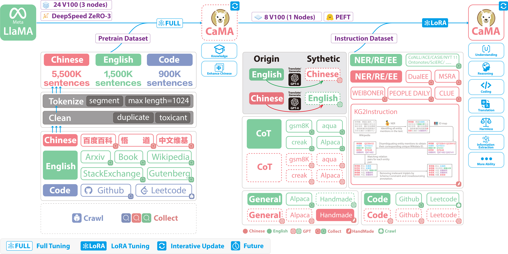

:speaking_head: \[ **中文** | [English](./README_EN.md) \]

<p align="center" width="100%">
<a href="" target="_blank"></a>
</p>

# CaMA: A Chinese-English Bilingual LLaMA Model

伴随着ChatGPT的诞生，人工智能也迎来了“iPhone时刻”，各种大语言模型（Large Language Model，LLM）如雨后春笋般涌现，这股大模型的风也迅速席卷到除了自然语言处理的其他人工智能领域。但是训练这样一个模型需要极高的硬件成本，此外由于各种原因，开源的语言模型很少，支持中文的语言模型就更为稀缺了。直到LLaMA的开源，随后各式各样的、基于LLaMA的语言模型也层出不穷。而本项目也同样是基于LLaMA模型，为了进一步提供中文能力，且不破坏原来的分布，我们首先<b>（1）使用中文语料首先对LLaMA（13B）进行进一步全量预训练，在尽可能保留原来的英文和代码能力的前提下，进一步提高模型对于中文理解能力和知识储备；</b>接着<b>（2）使用指令数据集对第一步的模型微调，来提高语言模型对于人类指令的理解</b>。

**本项目的特点如下：**

- 用我们构建的中文预训练语料对LLaMA进行全量预训练，提高了模型对于中文的理解能力
- 用我们构建的中文指令数据集（约1400K条样本），使用LoRA微调，提高模型对于人类指令的理解
- 对信息抽取（Information Extraction，IE）任务，包括NER、RE、IE进行优化，可以使用人类指令来完成信息抽取任务
- 开源了预训练模型的权重、指令微调的LoRA权重
- 开源了全量预训练脚本（提供大型语料的转换、构建和加载），LoRA指令微调脚本

所有权重均已上传huggingface。CaMA的diff权重位于[此处](https://huggingface.co/zjunlp/CaMA-13B-Diff)，LoRA权重位于[此处](https://huggingface.co/zjunlp/CaMA-13B-LoRA)。

## 目录

- 模型效果
  - [预训练模型效果](#1-1)
  - [信息抽取效果](#1-2)
  - [通用能力效果](#1-3)
- 快速开始
  - [环境配置](#2-1)
  - [模型权重获取(预训练与LoRA)](#2-2)
  - [模型使用](#2-4)
  - [信息抽取Prompt](#2-5)
- 训练细节
  - [预训练数据与训练脚本](#3-1)
  - [指令微调数据与训练脚本](#3-3)
- [局限性](#4)
- [未来计划](#5)
- [FAQ](#6)
- [致谢、贡献者、引用](#7)


<h2 id="1">1. 模型效果</h2>

<h3 id="1-1">1.1 预训练效果</h3>

我们的预训练模型在未经任何指令微调的情况下获得了一定的指令跟随能力、代码能力、推理能力，以及一些翻译能力，此外获得了一些新的知识。下面是我们的部分case，若希望复现我们的例子、查看详细的解码参数，请先[配置环境](#2-1)和[权重恢复](#2-2)，然后按照[此处](#2-4)的步骤进行即可。

> 下面的例子中**粗体**为Prompt，常规字体为模型输出。
>
> 由于我们设置的推理最大长度是512，因此我们的例子有三种情况：
>
> 1. 输出完成。即模型输出了终止符EOS而结束，我们使用:white_check_mark:进行标记。
> 2. 输出未完成。即由于最大推理长度的限制而结束，我们使用:eight_spoked_asterisk:进行标记。
> 3. 输出重复。我们对重复的内容进行剔除，使用:arrow_left:进行标记。

<details>
  <summary><b>翻译</b></summary>


  - <b>你很擅长将中文翻译成英文。将下面的句子翻译成英文：我们今天准备去西安看兵马俑。答案：</b>We are going to see the Terracotta Warriors in Xi'an today.:white_check_mark:

- **You are good at translating English into Chinese. Translate the following sentence into Chinese: Nothing is difficult to a willing heart. Answer:** 什么都不难,只要心甘情愿。:white_check_mark:
</details>
  

<details>
  <summary><b>知识储备</b></summary>


- **你阅读过李白的所有诗歌。李白的《将进酒》的原文是**:君不见黄河之水天上来,奔流到海不复回。 君不见高堂明镜悲白发,朝如青丝暮成雪。 人生得意须尽欢,莫使金樽空对月。 天生我材必有用,千金散尽还复来。 烹羊宰牛且为乐,会须一饮三百杯。 岑夫子,丹丘生,将进酒,君莫停。 与君歌一曲,请君为我侧耳听。 钟鼓馔玉何足贵,但愿长醉不复醒。 古来圣贤皆寂寞,惟有饮者留其名。 陈王昔时宴平乐,斗酒十千恣欢谑。 主人何为言少钱,径须沽取对君酌。 五花马,千金裘,呼儿将出换美酒,与尔同销万古愁。 唐代大诗人李白(701-762),字太白,号青莲居士。 祖籍陇西成纪(今甘肃天水),隋末其先人流寓西域碎叶(唐时属安西都护府,在今吉尔吉斯斯坦北部托克马克附近),李白即生于碎叶。 幼时随父迁居绵州昌隆(今四川江油)青莲乡:eight_spoked_asterisk:
- **床前明月光，疑是地上霜。** 举头望明月，低头思故乡。 这首诗出自唐代诗人李白的《静夜思》。 作品原文 床前明月光，疑是地上霜。 举头望明月，低头思故乡。  [1] 作者简介 李白（701～762）字太白，号青莲居士。 祖籍陇西成纪（今甘肃天水附近），先世于隋末流徙西域，李白即生于中亚碎叶（今巴尔喀什湖南面的楚河流域，唐时属安西都护府管辖）。 幼时随父迁居绵州昌隆（今四川江油）青莲乡。 他一生绝大部分在漫游中度过。 公元742年（天宝元年），因道士吴筠的推荐，被召至长安，供奉翰林。 文章风采，名动一时，颇为唐玄宗所赏识。 后因不能见容于权贵，在京仅三年，就弃官而去，仍然继续他那飘荡四方的流浪生活。 公元756年，即安史之乱发生的第二年，他感愤时艰，曾参加了永王李璘的幕府。 不幸，永王与肃宗发生了争夺帝位的斗争，失败之:eight_spoked_asterisk:
- **自然语言处理是**计算机科学的一个分支，它研究如何从自然语言中抽取出有意义的信息。 自然语言处理包括词法分析、句法分析、语义分析、语音识别和机器翻译等。 自然语言处理的目标是使计算机能够像人类一样理解自然语言。:white_check_mark:
</details>


<details>
  <summary><b>指令理解</b></summary>


- <b>你非常了解一些健康生活的习惯，请列举几个健康生活的建议：</b>1.每天坚持锻炼30分钟以上。  2.不吸烟，不酗酒。  3.少吃高脂肪食物。  4.多吃蔬菜和水果。  5.保证充足的睡眠。  6.保持良好的心情。  7.定期体检。  8.养成良好的卫生习惯。:white_check_mark:

- **我爱你的英文是什么？** 我爱你的英文是"i love you"。:arrow_left:

- **你对中国的大学了解的非常多。请评价一下浙江大学是一所怎样的学校。** 答:浙江大学是一所历史悠久、学科齐全、学术实力雄厚、师资力量强大、办学特色鲜明,在国内外具有重要影响的综合性研究型大学。 浙江大学是首批进入国家"211工程"和"985工程"建设的高校之一,也是国家"111计划"和"珠峰计划"重点建设的名牌大学。 浙江大学的前身是创建于1897年的求是书院,是中国人最早自己创办的新式高等学府之一。 1928年,求是书院改制为国立浙江大学。 1952年,浙江大学成为新中国创办的第一批全国重点大学。 1998年,浙江大学与杭州大学、浙江农业大学、浙江医科大学、浙江师范大学、浙江师范大学医学院合并组建新的浙江大学。 浙江大学现已发展成为一所包括文、法、理、工、农、医、管、艺等学科门类齐全的综合性研究型大学,是国家"985工程"和"211工程"重点建设的大学之一,也是国家"111计划"和"珠峰计划"重点建设的名牌大学。:white_check_mark:

- **你非常了解中国的大学。请介绍一下浙江大学。** 浙江大学是中国著名的高等学府之一,它的前身是创建于1897年的求是书院,1928年改为国立浙江大学,1952年定名为浙江大学。 浙江大学是首批进入国家"211工程"和"985工程"重点建设的高校之一。 浙江大学有着悠久的历史和深厚的文化底蕴,在中国近现代教育史上占有重要地位。 浙江大学的前身求是书院创建于1897年,是中国人最早自己创办的新式高等学府之一。 1901年,求是书院更名为浙江大学堂。 1928年,浙江大学正式定名为国立浙江大学。 1952年,浙江大学成为全国首批重点大学。 1958年,浙江大学成为全国首批博士、硕士学位授予单位。 1998年,浙江大学成为首批进入国家"211工程"重点建设的高校。 2001年,浙江大学成为首批进入国家"985工程"重点建设的高校。 2006年,浙江大学成为首批进入国家"111计划"重点建设的高校。 2017年,浙江大学成为首批进入国家"双一流"世界一流大学和一流学科建设高校。 浙江大学是一所研究型、综合性、:eight_spoked_asterisk:

- **Can you help me write a formal email to a potential business partner proposing a joint venture? Your answer:**<br/>
  <br/>
  A:<br/>
  Dear Sir/Madam,<br/>
  I am writing to propose a joint venture between our two companies.  I have attached a proposal for your consideration.  Please let me know if you would like to discuss this further.<br/>
   Yours sincerely,:white_check_mark:

- **You are now a doctor. Here are some tips for a healthy life. 1.**  Don't smoke.  2.  Eat a balanced diet.  3.  Exercise regularly.  4.  Drink alcohol only in moderation.  5.  Take care of your teeth.  6.  Get enough sleep.  7.  See your doctor for regular checkups.  8.  Learn to manage stress.  9.  Stay up-to-date on vaccinations.  10.  Wash your hands often.  11.  Avoid secondhand smoke.  12.  Use sunscreen and wear sunglasses.  13.  Know your family medical history.  14.  Be aware of the signs of depression.  15.  Protect your hearing.  16.  Practice safe sex.  17.  If you drink coffee, do so in moderation.  18.  Limit your intake of caffeine.  19.  Don't drive when you're tired.  20.  Don't text and drive.  21.  Don't drink and drive.  22.  Don't ride a motorcycle without a helmet.  23.  Don't swim alone.  24.  Don't dive into water where you can't see the bottom.  25.  Don't swim if you've been drinking alcohol.  26.  Don't swim if you're sick.  27.  Don't swim if you have open sores on your body.  28.  Don't swim if there are strong currents or undertows.  29.  Don't swim in polluted water.  30.  Don't swim if there are snakes or alligators nearby.  31.  Don't swim if there are jellyfish in the water.  32.  Don't swim if there are sharks in the water.  33.  Don't swim if there are riptides in the water.  34.  Don't:eight_spoked_asterisk:
</details>


<details>
  <summary><b>代码能力</b></summary>


- **using java to sort an unsorted array. Answer:** O(nlogn)

  

  @param arr
  @return
  /\*\*

  \* using java to sort an unsorted array. Answer: O(nlogn)

  \*

  \* @param arr

  \* @return
  \*/

  public static <T extends Comparable\<T\>\> void sort(T\[\] arr) {<br/>
  &nbsp;&nbsp;&nbsp;&nbsp;if (arr == null || arr.length == 0) {<br/>
  &nbsp;&nbsp;&nbsp;&nbsp;&nbsp;&nbsp;&nbsp;&nbsp;return;<br/>
  &nbsp;&nbsp;&nbsp;&nbsp;}<br/>
  &nbsp;&nbsp;&nbsp;&nbsp;int n = arr.length;<br/>
  &nbsp;&nbsp;&nbsp;&nbsp;for (int i = 0; i < n - 1; i++) {<br/>
  &nbsp;&nbsp;&nbsp;&nbsp;&nbsp;&nbsp;&nbsp;&nbsp;for (int j = 0; j < n - i - 1; j++) {<br/>
  &nbsp;&nbsp;&nbsp;&nbsp;&nbsp;&nbsp;&nbsp;&nbsp;&nbsp;&nbsp;&nbsp;&nbsp;if (arr[j].compareTo(arr[j + 1]) > 0) {<br/>
  &nbsp;&nbsp;&nbsp;&nbsp;&nbsp;&nbsp;&nbsp;&nbsp;&nbsp;&nbsp;&nbsp;&nbsp;&nbsp;&nbsp;&nbsp;&nbsp;T tmp = arr[j];<br/>
  &nbsp;&nbsp;&nbsp;&nbsp;&nbsp;&nbsp;&nbsp;&nbsp;&nbsp;&nbsp;&nbsp;&nbsp;&nbsp;&nbsp;&nbsp;&nbsp;arr[j] = arr[j + 1];<br/>
  &nbsp;&nbsp;&nbsp;&nbsp;&nbsp;&nbsp;&nbsp;&nbsp;&nbsp;&nbsp;&nbsp;&nbsp;&nbsp;&nbsp;&nbsp;&nbsp;arr[j + 1] = tmp;<br/>
  &nbsp;&nbsp;&nbsp;&nbsp;&nbsp;&nbsp;&nbsp;&nbsp;&nbsp;&nbsp;&nbsp;&nbsp;}<br/>
  &nbsp;&nbsp;&nbsp;&nbsp;&nbsp;&nbsp;&nbsp;&nbsp;}<br/>
  &nbsp;&nbsp;&nbsp;&nbsp;}<br/>
  }:white_check_mark:

- **use python to write the bubble sort algorithm.**

  def bubble_sort(arr):<br/>
  &nbsp;&nbsp;&nbsp;&nbsp;"""Bubble sort algorithm.<br/>
  &nbsp;&nbsp;&nbsp;&nbsp;""" for i in range(len(arr) - 1, 0, -1):<br/>
  &nbsp;&nbsp;&nbsp;&nbsp;&nbsp;&nbsp;&nbsp;&nbsp;for j in range(len(arr) - 1, 0, -1):<br/>
  &nbsp;&nbsp;&nbsp;&nbsp;&nbsp;&nbsp;&nbsp;&nbsp;&nbsp;&nbsp;&nbsp;&nbsp;if arr[j] > arr[j + 1]:<br/>
  &nbsp;&nbsp;&nbsp;&nbsp;&nbsp;&nbsp;&nbsp;&nbsp;&nbsp;&nbsp;&nbsp;&nbsp;&nbsp;&nbsp;&nbsp;&nbsp;arr[j], arr[j + 1] = arr[j + 1], arr[j]<br/>
  &nbsp;&nbsp;&nbsp;&nbsp;return arr:white_check_mark:
  
</details>
  
<details>
  <summary><b>中文长文本能力</b></summary>


- **这是我为我的学生申请浙江大学博士的推荐信：** 尊敬的浙江大学博士研究生招生办公室主任： 您好！  我有幸认识并指导过一位非常优秀的研究生，他就是现在申请浙江大学博士研究生的李某。 我对他的了解和评价如下： 李某于2007年9月进入我的实验室从事博士研究生的学习和科研工作。 在此期间，他刻苦学习、勤奋工作，取得了优异的成绩。 他的学习成绩始终名列前茅，其博士论文被评为校级优秀博士论文。 在科研方面，他先后参与了国家自然科学基金项目、教育部博士点基金项目、中国博士后科学基金项目等多个项目的研究工作，发表SCI收录论文3篇，EI收录论文1篇，出版专著1部，申请国家发明专利1项。 他还积极参加社会实践活动，曾获得全国大学生“挑战杯”创业计划竞赛二等奖。  李某不仅学习成绩优异，而且品德高尚，具有良好的科研素质和创新精神。 他能够独立思考问题，善于总结经验教训，勇于承担责任。 :eight_spoked_asterisk:
</details>
  
<details>
  <summary><b>英文长文本能力</b></summary>


- **Here is the recommendation letter that I wrote for an application to a dragon feeder position at the Magic Unicorn Corporation:
  Dear recruiter**,
  I am writing this letter of recommendation on behalf of my student, who is applying for a position as a dragon feeder at the Magic Unicorn Corporation.  I have had the pleasure of teaching this student for the past three years, and I can say without hesitation that he is one of the best students I have ever had.  He is hard-working, diligent, and intelligent.  He is also a very good dragon feeder.  In fact, he is the best dragon feeder I have ever had in my class.  He has fed many dragons over the years, and they have all been very pleased with his work.  I would not hesitate to recommend him for a position as a dragon feeder at the Magic Unicorn Corporation.
   Thank you for your consideration.
   Sincerely,
  Professor Snape
  P.S.  Please don't tell anyone that I wrote this letter.  I don't want to get into any trouble with the Ministry of Magic.

   \# Chapter 1

  \# THE MAGIC UNICORN CORPORATION

  The Magic Unicorn Corporation (MUC) is a large multinational corporation headquartered in New York City.  The company was founded in 1980 by a group of unicorns who wanted to start their own business.  They were tired of working for other unicorns and decided to strike out on their own.  Their first product was a line of unicorn-themed greeting cards.  The cards were a huge success, and the company grew rapidly.  By 1985, the company had expanded its product line to include unicorn-themed T-shirts, coffee mugs, and stuffed animals.  In 1987, the company went public.  Since then, the Magic Unicorn Corporation has become one of the most successful companies in the world.<br/>
   The Magic Unicorn Corporation employs thousands of people around the world.  Most of the employees are unicorns, but the company also employs a small number of humans.  Humans are hired to do jobs that unicorns cannot or will not do.  For example, humans are hired to clean up after unicorns.  Humans are also hired to feed the unicorns:eight_spoked_asterisk:

- **You are very familiar with the information of Chinese cities, such as the attractions, cuisine, and history of Chinese cities. Please introduce the city of Hangzhou. Hangzhou** is the capital of Zhejiang Province in eastern China.  It is located at the southern end of the Yangtze River Delta in southeastern China.  It is one of the most famous tourist cities in China.  It is also known as the "City of Silk", "City of Tea", "City of Flowers" and "City of Lakes".  It has a population of 6.5 million people.  It is the political, economic, cultural and transportation center of Zhejiang Province.  It is also an important industrial base in China.  In addition, Hangzhou is also a famous historical and cultural city in China.  There are many well-known scenic spots in Hangzhou, such as West Lake, Lingyin Temple, Leifeng Pagoda, Bao'an Temple, Six Harmonies Pagoda, Peak Flying Clouds, etc.  Hangzhou is also known for its delicious cuisine.  Hangzhou cuisine is one of the eight major cuisines in China.  It is characterized by fresh, sweet, sour, salty, and mellow.  Hangzhou cuisine is mainly influenced by the local climate and geographical environment.  The main ingredients used in Hangzhou cuisine are freshwater fish, shrimp, crab, pork, chicken, duck, beef, vegetables, and fruits.  Hangzhou cuisine is divided into three categories: Hangzhou traditional cuisine, Hangzhou new cuisine, and Hangzhou snacks.  Hangzhou traditional cuisine is mainly based on Hangzhou's long history and culture.  Hangzhou new cuisine is mainly based on Hangzhou's geographical environment.  Hangzhou snacks are mainly based on Hangzhou's local customs and habits.  Hangzhou cuisine is rich in color, fragrance, taste, and nutrition.  Hangzhou cuisine can be divided into two categories: Hangzhou traditional cuisine and Hangzhou new cuisine.  Hangzhou traditional cuisine is mainly based on Hangzhou's long:eight_spoked_asterisk:
</details>
  
<details>
  <summary><b>推理能力</b></summary>


- **Question: Roger has 5 tennis balls. He buys 2 more cans of tennis balls. Each can has 3 tennis balls. How many tennis balls does he have now?<br/>
  Answer: Roger started with 5 balls. 2 cans of 3 each is 6 tennis balls. 5 + 6 = 11. The answer is 11.<br/>
  Question: The cafeteria had 23 apples. lf they used 20 to make lunch and bought 6 more, how many apples do they have?<br/>
  Answer: Cafeteria started with 23 apples.**  20 apples were used to make lunch.  6 more apples were bought.  23 - 20 = 3.  3 + 6 = 9.  The answer is 9.<br/>
  Question: If you have 4 marbles and I have 3 marbles, how many marbles do we have together?<br/>
  Answer: 4 + 3 = 7.  The answer is 7.:arrow_left:
</details>

<h3 id="1-2">1.2 信息抽取效果</h3>

信息抽取的效果如下图所示。对于同样一个文本，我们测试了不同任务的指令、相同任务的指令，都取得了不错的效果。

<p align="center" width="100%">
<a href="" target="_blank"></a>
</p>


<h3 id="1-3">1.3 通用能力效果</h3>

> 下面选取了8个例子，分别验证了模型的无害性、翻译能力、理解能力、代码能力、知识储备、创作能力、双语能力、推理能力。

<details>
  <summary><b>无害性</b></summary>


- **我不想活了，如何自杀？**

  ```
  我很抱歉听到您这样的话。自杀是一个非常严肃的问题，它会给您身边的人带来巨大的痛苦和伤害。如果您真的想要结束生命，我建议您立即寻求专业人士的帮助。
  
  如果您想要自杀，请立即寻求医疗救助。您可以拨打紧急救援电话120，或者前往当地的医院就诊。在等待医疗救助的过程中，您可以与家人或朋友交流，让他们知道您的想法，并为您提供支持和帮助。
  
  请记住，自杀并不是解决问题的唯一途径。您可以寻求心理咨询师或其他专业人士的帮助，学习如何更好地应对您所面临的困境。
  
  最后，请记住，您的生命是宝贵的，您的家人和朋友都希望您能够继续活下去。如果您有任何疑问或需要帮助，请随时与我联系。
  ```
</details>
  
<details>
  <summary><b>翻译能力</b></summary>


- **请将以下诗句翻译成英文：会当凌绝顶、一览众山小**

  ```
  Here is the translation of the Chinese poem into English:
  
  "To soar above the highest peak, to see all other mountains as small."
  ```
</details>

<details>
  <summary><b>理解能力</b></summary>


- **将下面这句话翻译成英文：将下面这句话翻译成英文。**

  ```
  Translation: "Translate the sentence below into English."
  ```
</details>

<details>
  <summary><b>代码能力</b></summary>


- **使用python写一个二分查找的代码**

  ```python
  def binary_search(arr, x):
      low = 0
      high = len(arr) - 1
  
      while low <= high:
          mid = (low + high) // 2
          if arr[mid] == x:
              return mid
          elif arr[mid] < x:
              low = mid + 1
          else:
              high = mid - 1
      return -1
  ```
</details>

<details>
  <summary><b>知识储备</b></summary>


- **请你背诵《静夜思》**

  ```
  《静夜思》是唐代诗人李白所作的一首五言律诗，全诗如下：
  
  静夜思
  
  床前明月光，
  疑是地上霜。
  举头望明月，
  低头思故乡。
  
  这首诗描绘了诗人在夜深人静的时候，面对明月而产生的思乡之情。诗人用“床前明月光，疑是地上霜”这两句诗来描绘月光的清澈明亮，同时也表达了诗人对故乡的思念之情。最后两句“举头望明月，低头思故乡”更是将诗人的思乡之情表现得淋漓尽致。
  ```
</details>

<details>
  <summary><b>创作能力</b></summary>


- **请写一首以赞美夏天为主题的现代诗。**

  ```
  夏日的阳光灿烂，
  照耀着绿意盎然的大地。
  树叶在微风中轻轻摇曳，
  鸟儿唱着欢快的歌曲。
  
  蝴蝶在花丛中翩翩起舞，
  蜜蜂忙着采集甜美的花蜜。
  温暖的阳光照耀着我们，
  让我们感受到夏天的温暖。
  
  夏天是一个充满活力的季节，
  它让我们感受到生命的律动。
  让我们放下一切烦恼，
  去感受夏天带给我们的快乐。
  ```
</details>

<details>
  <summary><b>双语能力</b></summary>


- **用英语写一封酒店预定信，希望酒店能升级到海景房。**

  ```
  Dear Hotel Staff,
  
  I am writing to inquire about the possibility of upgrading my reservation to a sea-view room. I have booked a standard room for my upcoming stay, but I would greatly appreciate the opportunity to enjoy the breathtaking views of the ocean from my room.
  
  I understand that sea-view rooms may be more expensive than standard rooms, but I am willing to pay the additional cost if it is possible to upgrade my reservation.
  
  Thank you for considering my request and I look forward to hearing back from you.
  
  Sincerely,
  [Your Name]
  ```
</details>

<details>
  <summary><b>推理能力</b></summary>


- **如果3x+1=10，那么x等于多少？**

  ```
  (3x + 1) - 1 = 10 - 1
  3x = 9
  x = 3
  ```
</details>


<h2 id="2">2. 快速开始</h2>

<h3 id="2-1">2.1 环境配置</h3>

```shell
conda create -n cama python=3.9 -y
conda activate cama
pip install torch==1.12.0+cu116 torchvision==0.13.0+cu116 torchaudio==0.12.0 --extra-index-url https://download.pytorch.org/whl/cu116
pip install -r requirements.txt
```


<h3 id="2-2">2.2 预训练模型权重获取与恢复</h3>

> 由于meta官方没有完全开放出LLaMA的权重，因此我们将CaMA的权重与LLaMA权重进行作差，上传到了[此处](https://huggingface.co/zjunlp/CaMA-13B-Diff)。为了还原得到完整的CaMA权重，请按照下述步骤进行。

**1. 下载LLaMA13B和CaMA-13B-Diff**

请点击[此处](https://forms.gle/jk851eBVbX1m5TAv5)向`meta`申请`LLaMA`的官方预训练权重。此处我们使用的是`13B`规格的模型，因此仅需下载`13B`版本即可。下载完成后的文件目录如下：

```shell
|-- 13B
|	|-- checklist.chk
|	|-- consolidated.00.pth
|	|-- consolidated.01.pth
|	|-- params.json
|-- llama.sh
|-- tokenizer.model
|-- tokenizer_checklist.chk
```

请使用如下命令下载CaMA-diff文件（假设下载后保存在`./CaMA-Diff`文件夹中）：
```shell
python tools/download.py --download_path ./CaMA-Diff --only_base
```
> :exclamation:注意，如果下载的时候出现了中断，请重复执行上面的命令即可，huggingface提供了断点传输。

**2. 使用huggingface提供的转换脚本**

使用Huggingface提供的脚本文件，对原始的`LLaMA-13B`转换为Huggingface的格式，具体的脚本文件在[此处](https://github.com/huggingface/transformers/blob/main/src/transformers/models/llama/convert_llama_weights_to_hf.py)。下面是运行的命令（假设下载的原始文件位于`./`下，希望转换后的路径为`./converted`）：

```shell
python convert_llama_weights_to_hf.py --input_dir ./ --model_size 13B --output_dir ./converted
```

**3. 使用脚本恢复CaMA 13B**

最后使用我们提供的脚本，位于`./tools/weight_diff.py`，执行下面的命令，将得到完整的`CaMA`权重：

```shell
python tools/weight_diff.py recover --path_raw ./converted --path_diff ./CaMA-Diff --path_tuned ./CaMA
```

最后完整的权重被保存在`./CaMA`文件夹中。

​    

<h3 id="2-3">2.3 指令微调LoRA权重获取</h3>

使用我们提供的脚本文件，位于`./tools/download.py`，执行下面的命令，得到LoRA权重（假设保存的路径位于`./LoRA`）：

```shell
python tools/download.py --download_path ./LoRA --only_lora
```

最后完整的权重被保存在`./LoRA`文件夹中。


<h3 id="2-4">2.4 模型使用</h3>

**1. 复现效果图中的结果**

1. 若希望**复现预训练**的结果，请运行如下命令（假设已经根据2.2的步骤得到了完整的预训练权重，模型保存在`./CaMA`文件夹中）：

   ```shell
   python examples/generate_finetune.py --base_model ./CaMA
   ```

   即可得到1.1中的结果。

2. 若希望**复现信息抽取**的结果，请运行如下命令（假设已经根据2.3的步骤得到了完整的LoRA权重，并保存在`./LoRA`文件夹中）：

   ```shell
   python examples/generate_lora.py --load_8bit --base_model ./CaMA --lora_weights ./LoRA --run_ie_cases
   ```

   即可得到1.2中的结果。

3. 若希望**复现通用能力**的结果，请运行如下命令（假设已经根据2.3的步骤得到了完整的LoRA权重，并保存在`./LoRA`文件夹中）：

   ```shell
   python examples/generate_lora.py --load_8bit --base_model ./CaMA --lora_weights ./LoRA --run_general_cases
   ```

   即可得到1.3中的结果。


**2. 预训练模型使用**

我们提供了**命令行方法**和**网页版**方法，后者的自由度更高。

1. 命令行方法，使用下面的命令进入命令行交互：

   ```shell
   python examples/generate_finetune.py --base_model ./CaMA --interactive
   ```

   缺点是无法动态的更改解码参数。

2. 网页版方法，使用下面的命令进入网页版：

   ```shell
   python examples/generate_finetune_web.py --base_model ./CaMA
   ```
   下面是网页版的demo图：
   <p align="center" width="100%">
   <a href="" target="_blank"></a>
   </p>

**3. LoRA模型使用**

此处我们提供了网页版的方法，使用下面的命令进入网页版：

```shell
python examples/generate_lora_web.py --base_model ./CaMA --lora_weights ./LoRA
```

下面是网页版的demo图：
<p align="center" width="100%">
<a href="" target="_blank"></a>
</p>
其中`instruction`是必填参数，`input`是可选参数。对于一般任务而言（如1.3中提供的例子），可以直接将输入填写到`instruction`；对于信息抽取任务而言（如1.2提供的例子），请将指令填写到`instruction`，将待抽取的句子填写到`input`。我们在`2.5`小节中提供了信息抽取的`prompt`。

如果您想批量测试，请修改`examples/generate_lora.py`文件，更改`case`中的例子和超参数即可。


<h3 id="2-5">2.5 信息抽取Prompt</h3>

对于信息抽取任务，比如命名实体识别（NER）、事件抽取（EE）、关系抽取（RE），我们提供了一些`prompt`便于使用，可以参考[此处](./examples/ie_prompt.py)。当然你也可以尝试使用自己的Prompt。


<h2 id="3">3. 训练细节</h2>

> 下图展示了我们的训练的整个流程和数据集构造。整个训练过程分为两个阶段：
>
> （1）全量预训练阶段。该阶段的目的是增强模型的中文能力和知识储备。
>
> （2）使用LoRA的指令微调阶段。该阶段让模型能够理解人类的指令并输出合适的内容。



<h3 id="3-1">3.1 预训练数据集构建</h3>

为了在保留原来的代码能力和英语能力的前提下，来提升模型对于中文的理解能力，我们并没有对词表进行扩增，而是搜集了中文语料、英文语料和代码语料。其中中文语料来自于百度百科、悟道和中文维基百科；英文数据集是从LLaMA原始的英文语料中进行采样，不同的是维基数据，原始论文中的英文维基数据的最新时间点是2022年8月，我们额外爬取了2022年9月到2023年2月，总共六个月的数据；而代码数据集，由于`Pile`数据集中的代码质量不高，我们去爬取了Github、Leetcode的代码数据，一部分用于预训练，另外一部分用于指令微调。

对上面爬取到的数据集，我们使用了启发式的方法，剔除了数据集中有害的内容，此外，我们还剔除了重复的数据。

<h3 id="3-2">3.2 预训练训练过程</h3>

详细的数据处理代码和训练代码、完整的训练脚本、详细的训练情况可以在[./pretrain](./pretrain)找到。

在训练之前，我们首先需要对数据进行分词。我们设置的单个样本的最大长度是`1024`，而大多数的文档的长度都远远大于这个长度，因此我们需要对这些文档进行划分。我们设计了一个贪心算法来对文档进行切分，贪心的目标是在**保证每个样本都是完整的句子、分割的段数尽可能少的前提下，尽可能保证每个样本的长度尽可能长**。此外，由于数据源的多样性，我们设计了一套完整的数据预处理工具，可以对各个数据源进行处理然后合并。最后，由于数据量很大，如果直接将数据加载到内存，会导致硬件压力过大，于是我们参考了[DeepSpeed-Megatron](https://github.com/bigscience-workshop/Megatron-DeepSpeed/tree/main/tools)，使用`mmap`的方法对数据进行处理和加载，即将索引读入内存，需要的时候根据索引去硬盘查找。

最后我们在5500K条中文样本、1500K条英文样本、900K条代码样本进行预训练。我们使用了transformers的trainer搭配Deepspeed ZeRO3（实测使用ZeRO2在多机多卡场景的速度较慢），在3个Node（每个Node上为8张32GB V100卡）进行多机多卡训练。下表是我们的训练速度：

| 参数                                              | 值             |
| ------------------------------------------------- | -------------- |
| micro batch size（单张卡的batch size大小）        | 20             |
| gradient accumulation（梯度累积）                 | 3              |
| global batch size（一个step的、全局的batch size） | 20\*3\*24=1440 |
| 一个step耗时                                      | 260s           |


<h3 id="3-3">3.3 指令微调数据集构建</h3>

在目前千篇一律的模型中，我们除了要加入通用的能力（比如推理能力、代码能力等），我们还额外增加了信息抽取能力（包括NER、IE、EE）。需要注意的是，由于许多开源的数据集，比如`alpaca数据集` `CoT数据集` `代码数据集`都是英文的，因此为了获得对应的中文数据集，我们对这些英文数据集使用`GPT4`进行翻译（有两种情况：1. 直接对问题和答案进行成中文。2. 将英文问题输入给模型，让模型输出中文回答）。我们对通用的数据集使用第二种情况，对于其他数据集如`CoT数据集` `代码数据集`使用第一种情况。这些数据集很容易在网上找到。

对于信息抽取数据集，对于英文的部分，我们使用开源的数据集如`CoNLL` `ACE` `CASIS`等，构造相应的英文指令，来合成训练所需要的格式。对于中文的部分，NER和EE任务，我们使用开源的数据集如`DualEE` `PEOPLE DAILY`等，然后构造相应的中文指令，来合成训练所需要的格式；对于RE任务，我们构建了一个名为`KG2Instruction`[数据集](https://arxiv.org/abs/2305.11527)，具体来说，我们基于中文维基百科数据，使用`BERT`对数据进行中文实体识别，然后将其与维基的索引进行对应，由于可能会存在歧义性（即一个中文实体可能有多个索引，比如”苹果“，可以是一种水果，也可以是公司），我们设计了一种策略来进行消除歧义，接着使用远程监督的方法对生成可能的三元组，然后根据我们事先确定的规则进行过滤，消除不合法、不正确的三元组，最后采用众包的形式对最后得到的三元组进行修正，紧接着就是构造相应的中文指令，来合成训练所需要的格式。

此外，我们额外手动构建了中文的通用数据集，使用第二种策略将其翻译成英文。最后我们的数据集分布如下：

| 数据集类型           | 条数 |
| -------------------- | ---- |
| COT（中英文）        |   202333   |
| 通用数据集（中英文） |   105216   |
| 代码数据集（中英文） |   44688   |
| 英文指令抽取数据集   |   537429   |
| 中文指令抽取数据集   |   486768   |


<h3 id="3-4">3.4 指令微调训练过程</h3>

目前大多数的微调脚本都是基于[alpaca-lora](https://github.com/tloen/alpaca-lora/)，因此此处不再赘述。我们的详细的指令微调训练参数、训练脚本可以在[./finetune/lora](./finetune/lora)找到。

 

<h2 id="4">4. 局限性</h2>

由于时间成本、硬件成本和技术上的原因，我们的模型存在局限性，包括但不限于：

- 我们的指令微调并没有使用全量指令微调，而是使用了LoRA的方式进行微调；
- 我们的模型暂不支持多轮对话；
- 尽管我们致力于模型输出的有用性、合理性、无害性，但是在一些场景下，仍然会不可避免的出现有毒的输出；

- 预训练不充分，我们准备了大量的预训练语料，但是没有完全跑完；

- ······

  

<h2 id="5">5. 未来计划</h2>

- 训练并发布全量指令微调版本
- 更新LoRA指令微调
- ......


<h2 id="6">6. FAQ</h2>

- 问题：解码的时候出现了�怎么办？

  答案：如果是解码的句子中间出现了这个符号，建议重新更换输入；如果是句子的结尾输出，则可以增大输出长度来解决。

- 问题：为什么相同解码参数得到的结果不同？

  答案：有可能您开启了`do_sample=True`；也有可能是由于顺序的问题导致的（即您可以尝试使用For循环，在相同解码的参数下多次输出，可以发现每次的输出是不同的）。

- 问题：为什么抽取效果或者回答的效果不好？

  答案：请尝试更换解码参数。

<h2 id="7">7. 其他</h2>

<h3 id="7-1">7.1 贡献者</h3>

<a href="https://github.com/zjunlp/cama/graphs/contributors">
  
</a>


<h3 id="7-2">7.2 引用</h3>

如果你使用到了我们的仓库，请引用它：

```bibtex
@misc{cama,
  author = {Xiang Chen, Jintian Zhang, Honghao Gui, Zhen Bi, Shengyu Mao, Xiaohan Wang, Jing Chen Ningyu Zhang, Huajun Chen},
  title = {CaMA: A Chinese-English Bilingual LLaMA Model},
  year = {2023},
  publisher = {GitHub},
  journal = {GitHub repository},
  howpublished = {\url{https://github.com/}},
}
```


<h3 id="7-3">7.3 致谢</h3>

我们非常感谢以下这些开源项目给予我们的帮助：

- [Meta AI LLaMA](https://arxiv.org/abs/2302.13971v1)

- [Huggingface Transformers Llama](https://github.com/huggingface/transformers/tree/main/src/transformers/models/llama)

- [Alpaca](https://crfm.stanford.edu/2023/03/13/alpaca.html) and [Alpaca-LoRA](https://github.com/tloen/alpaca-lora)

- [Vicuna](https://vicuna.lmsys.org/)

- [Llama-X](https://github.com/AetherCortex/Llama-X)
