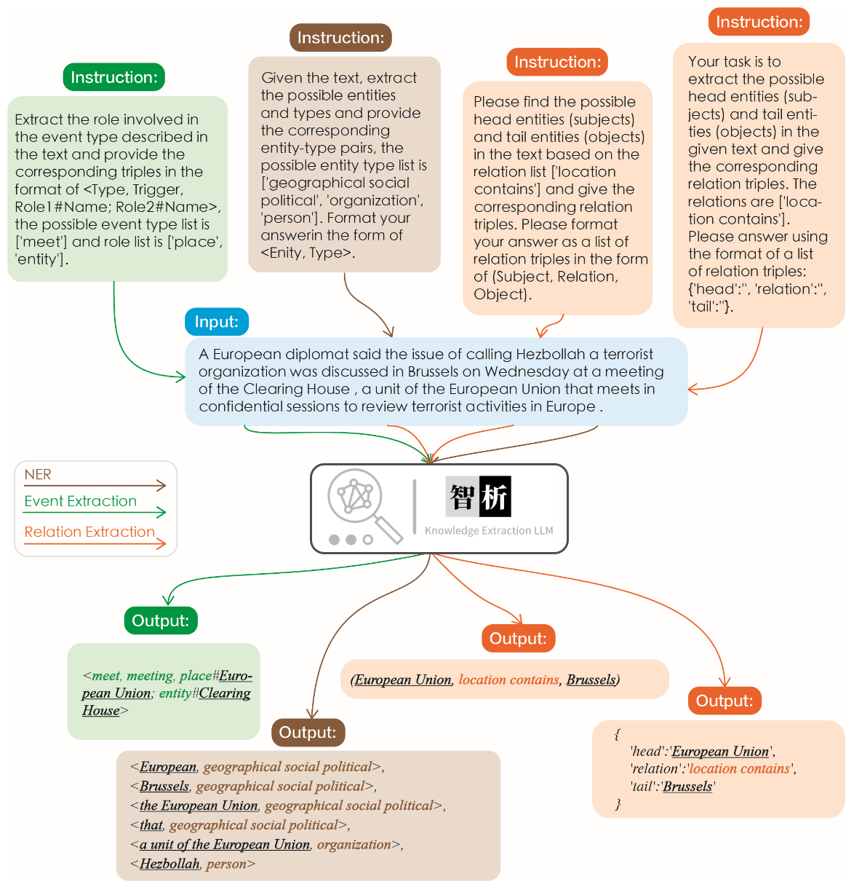
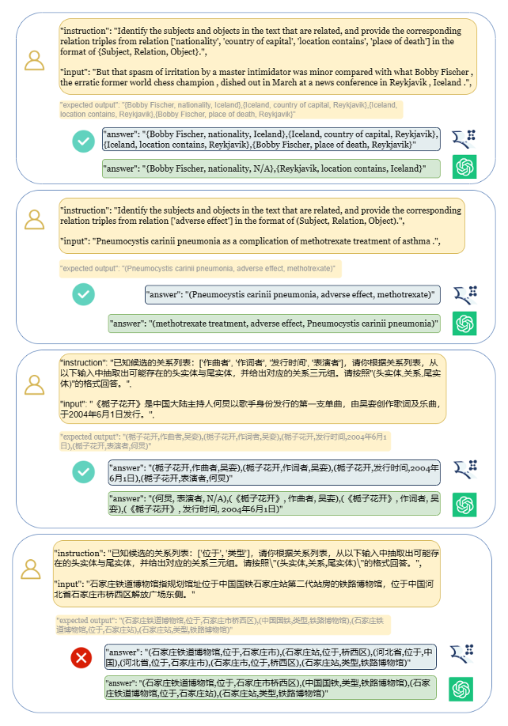
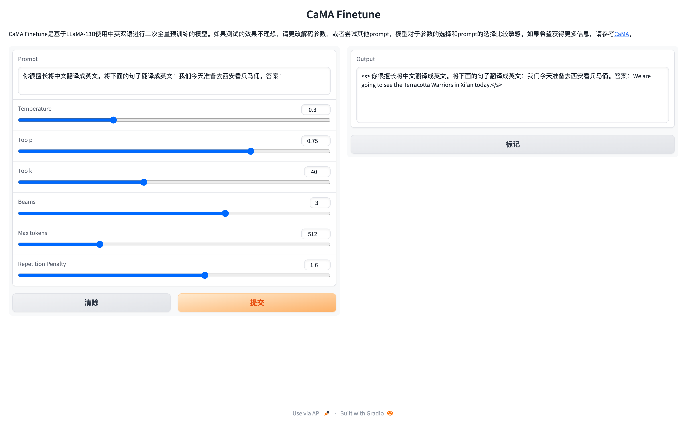
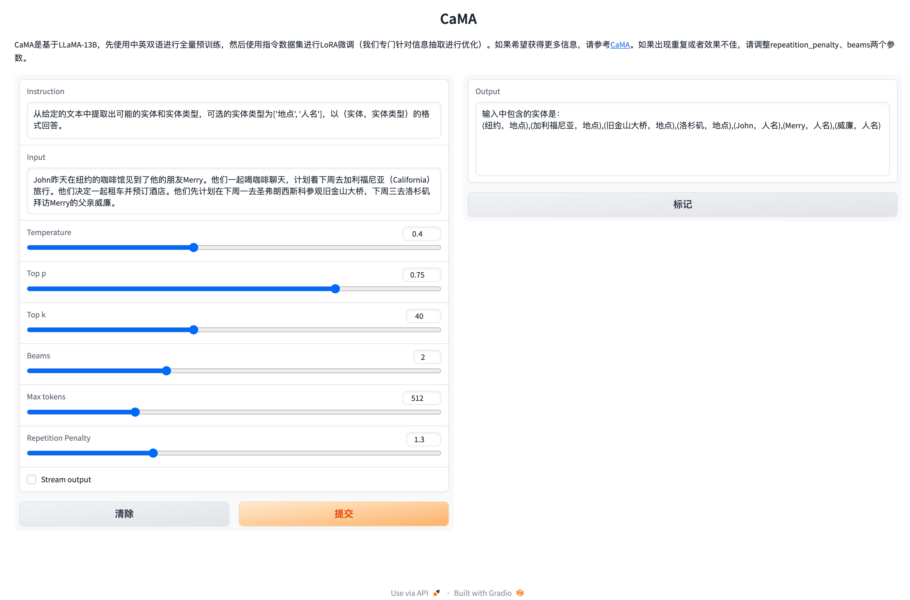
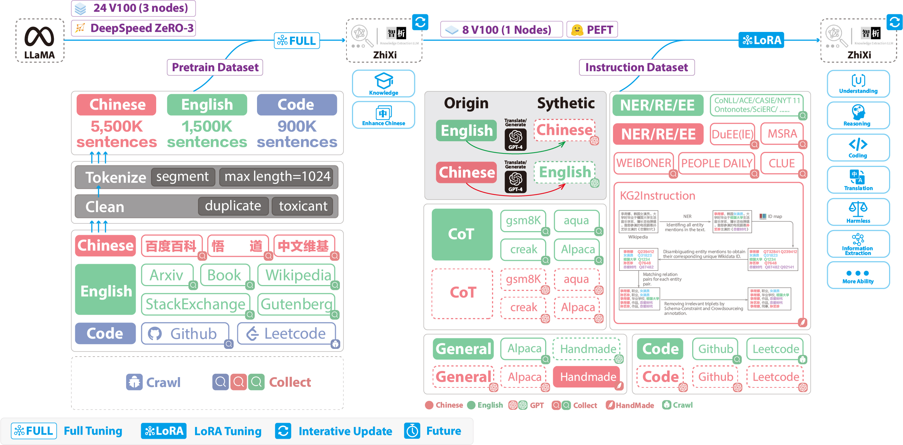
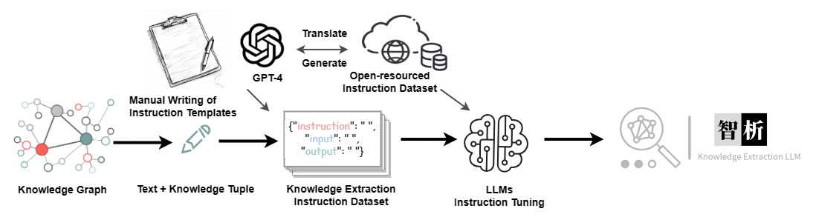

:speaking_head: \[ [中文](./README.md) | **English** \]

<p align="center">
    <br>
    
    <br>
</p>

# Knowledgable Large Language Model Framework.

With the rapid development of deep learning technology, large language models such as ChatGPT have made substantial strides in the realm of natural language processing. However, these expansive models still encounter several challenges in acquiring and comprehending knowledge, including the difficulty of updating knowledge and potential knowledge discrepancies and biases, collectively known as **knowledge fallacies**. The KnowLM project endeavors to tackle these issues by launching an open-source large-scale knowledgable language model framework and releasing corresponding models. 

The project's `initial phase` introduced a knowledge extraction LLM based on LLaMA, dubbed **ZhiXi** (**智析**, which means intelligent analysis of data for knowledge extraction). To integrate the capacity of Chinese understanding into the language models without compromising their inherent knowledge, we firstly <b>(1) use Chinese corpora for the full-scale pre-training with LLaMA (13B), augment the language model's understanding of Chinese and improve its knowledge richness while retaining its original English and code capacities;</b> Then <b>(2) we fine-tune the model obtained from the first step with an instruction dataset, thus bolstering the language model's understanding of human instructions for knowledge extraction.</b>
- ❗Please note that this project is still undergoing optimization, and the model weights will be regularly updated to support new features and models!

**The features of this project are as follows:**

- Centered on knowledge and large models, a **full-scale pre-training** of the large model, such as LLaMA, is conducted using the built Chinese&English pre-training corpus.
- Based on the technology of **KG2Instructions**, the knowledge extraction tasks, including NER, RE, and IE, are optimized and can be completed using human instructions.
- Using the built Chinese instruction dataset (approximately 1400K), LoRA fine-tuning is used to enhance the model's understanding of human instructions.
- The weights of the pre-training model and LoRA's instruction fine-tuning are open-sourced.
- The **full-scale pre-training code** (providing conversion, construction, and loading of large corpora) and **LoRA instruction fine-tuning code** are open-sourced (support multi-machine multi-GPU).


All weights have been uploaded to HuggingFace🤗. It should be noted that all the following effects are based on `ZhiXi-13B-Diff`. If you have downloaded `ZhiXi-13B-Diff-fp16`, there may be some variations in the effects.
| Model Name       | Train Method    | Weight Type          | Size     | Download Link                           | Notes                                                         |
| -------------- | ------------ | --------------------- | -------- | ---------------------------------- | ------------------------------------------------------------ |
| ZhiXi-13B-Diff | Full Pretraining   | Differential Weights | 48GB     | [HuggingFace](https://huggingface.co/zjunlp/zhixi-13b-diff) <br/> [GoogleDrive](https://drive.google.com/drive/folders/1PZDqZNaBJYQYeON1-9aFBtagktEWAtUK?usp=drive_link)| Restoring the pre-trained weights (i.e. **ZhiXi-13B**) needs to match the weights of `LLaMA-13B`, please refer to [here](#2-2) for specific instructions. |
| ZhiXi-13B-Diff-fp16 | Full Pretraining   | Differential Weights(fp16) | 24GB     | [HuggingFace](https://huggingface.co/zjunlp/zhixi-13b-diff-fp16) <br/> [Google Drive](https://drive.google.com/drive/folders/1LYm-HUSSQ5Rl8nqZcswdiSpcP9xYTXaO?usp=sharing) | The main difference with `ZhiXi-13B-Diff` is the adoption of the `fp16` format for storage, which reduces memory usage. However, it may result in slight differences in the weights obtained from our actual training, which can slightly impact performance. For specific usage instructions, please refer to [here](#2-2) for specific instructions. |
| ZhiXi-13B-LoRA | LoRA Instruction-tuning | LoRA Weights              | 251MB    | [HuggingFace](https://huggingface.co/zjunlp/zhixi-13b-lora) <br/>  [GoogleDrive](https://drive.google.com/drive/folders/1GLyaWIyDIayudrQhb_tJYoNPAUk1xByS?usp=drive_link) | It needs to be used with **ZhiXi-13B**. For specific instructions, please refer to [here](#2-4).          |
| ZhiXi-7B Series   | Coming soon     | Coming soon            | Coming soon | Coming soon                           | Coming soon                                                 |


## NEWS
- \[**June 2023**\] The project name has been changed from `CaMA` to `KnowLM`.
- \[**June 2023**\] Release the first version of pre-trained weights and the LoRA weights.

## Why it's called ZhiXi (智析)?
In Chinese, "Zhi" (智) signifies intelligence, referencing the AI's advanced language understanding capabilities. "Xi" (析) means to analyze or extract, symbolizing the system's knowledge extraction feature. Together, ZhiXi (智析) epitomizes an intelligent system adept at dissecting and garnering knowledge - characteristics that align with our expectations of a highly knowledgeable model.

## Contents

- [Cases](#1)
  - [Pretraining Cases](#1-1)
  - [Information Extraction Cases](#1-2)
  - [General Ability Cases](#1-3)
- [Quick Start](#2)
  - [Environment Configuration](#2-1)
  - [Model Weight(Pretrain and LoRA)](#2-2)
  - [Model Usage Guide](#2-4)
  - [Information Extraction Prompt](#2-5)
  - [Combining ZhiXi-13B-LoRA Weights with ZhiXi-13B Weights](#2-6)
  - [MD5](#2-7)
- [Training Details](#3)
  - [Pertraining data and Pretraining scripts](#3-1)
  - [Instruction data and Instruction-tuning scripts](#3-3)
- [Limitations](#4)
- [TODO List](#5)
- [FAQ](#6)
- [Acknowledgments/Contributors/Citations](#7)


<h2 id="1">1. Cases</h2>

<h3 id="1-1">1.1 Pretraining Cases</h3>

Our pre-trained model has demonstrated certain abilities in instruction following, coding, reasoning, as well as some translation capabilities, without any fine-tuning using instructions. Additionally, it has acquired new knowledge. Below are some of our sample cases. If you wish to reproduce our examples and view detailed decoding configuration, please first [set up the environment](#2-1) and [restore the weights](#2-2), then follow the steps outlined [here](#2-4).

> In the follwing cases, text in **bold** represents the prompt, while non-bold text represents the model's output.
>
> Due to the maximum inference length set to 512, our cases fall into three situations:
>
> 1. Compeleted output. The model generates the termination token EOS and completes the output. We mark this with :white_check_mark:.
> 2. Incomplete output. The output is cut off due to the maximum inference length. We mark this with :eight_spoked_asterisk:.
> 3. Repeated output. We remove repeated content manually and mark it with :arrow_left:.

<details>
  <summary><b>Translation</b></summary>


  - <b>你很擅长将中文翻译成英文。将下面的句子翻译成英文：我们今天准备去西安看兵马俑。答案：</b>We are going to see the Terracotta Warriors in Xi'an today.:white_check_mark:

- **You are good at translating English into Chinese. Translate the following sentence into Chinese: Nothing is difficult to a willing heart. Answer:** 什么都不难,只要心甘情愿。:white_check_mark:
</details>
  

<details>
  <summary><b>Knowledge</b></summary>


- **你阅读过李白的所有诗歌。李白的《将进酒》的原文是**:君不见黄河之水天上来,奔流到海不复回。 君不见高堂明镜悲白发,朝如青丝暮成雪。 人生得意须尽欢,莫使金樽空对月。 天生我材必有用,千金散尽还复来。 烹羊宰牛且为乐,会须一饮三百杯。 岑夫子,丹丘生,将进酒,君莫停。 与君歌一曲,请君为我侧耳听。 钟鼓馔玉何足贵,但愿长醉不复醒。 古来圣贤皆寂寞,惟有饮者留其名。 陈王昔时宴平乐,斗酒十千恣欢谑。 主人何为言少钱,径须沽取对君酌。 五花马,千金裘,呼儿将出换美酒,与尔同销万古愁。 唐代大诗人李白(701-762),字太白,号青莲居士。 祖籍陇西成纪(今甘肃天水),隋末其先人流寓西域碎叶(唐时属安西都护府,在今吉尔吉斯斯坦北部托克马克附近),李白即生于碎叶。 幼时随父迁居绵州昌隆(今四川江油)青莲乡:eight_spoked_asterisk:
- **床前明月光，疑是地上霜。** 举头望明月，低头思故乡。 这首诗出自唐代诗人李白的《静夜思》。 作品原文 床前明月光，疑是地上霜。 举头望明月，低头思故乡。  [1] 作者简介 李白（701～762）字太白，号青莲居士。 祖籍陇西成纪（今甘肃天水附近），先世于隋末流徙西域，李白即生于中亚碎叶（今巴尔喀什湖南面的楚河流域，唐时属安西都护府管辖）。 幼时随父迁居绵州昌隆（今四川江油）青莲乡。 他一生绝大部分在漫游中度过。 公元742年（天宝元年），因道士吴筠的推荐，被召至长安，供奉翰林。 文章风采，名动一时，颇为唐玄宗所赏识。 后因不能见容于权贵，在京仅三年，就弃官而去，仍然继续他那飘荡四方的流浪生活。 公元756年，即安史之乱发生的第二年，他感愤时艰，曾参加了永王李璘的幕府。 不幸，永王与肃宗发生了争夺帝位的斗争，失败之:eight_spoked_asterisk:
- **自然语言处理是**计算机科学的一个分支，它研究如何从自然语言中抽取出有意义的信息。 自然语言处理包括词法分析、句法分析、语义分析、语音识别和机器翻译等。 自然语言处理的目标是使计算机能够像人类一样理解自然语言。:white_check_mark:
</details>


<details>
  <summary><b>Instruction Following</b></summary>


- <b>你非常了解一些健康生活的习惯，请列举几个健康生活的建议：</b>1.每天坚持锻炼30分钟以上。  2.不吸烟，不酗酒。  3.少吃高脂肪食物。  4.多吃蔬菜和水果。  5.保证充足的睡眠。  6.保持良好的心情。  7.定期体检。  8.养成良好的卫生习惯。:white_check_mark:

- **我爱你的英文是什么？** 我爱你的英文是"i love you"。:arrow_left:

- **你对中国的大学了解的非常多。请评价一下浙江大学是一所怎样的学校。** 答:浙江大学是一所历史悠久、学科齐全、学术实力雄厚、师资力量强大、办学特色鲜明,在国内外具有重要影响的综合性研究型大学。 浙江大学是首批进入国家"211工程"和"985工程"建设的高校之一,也是国家"111计划"和"珠峰计划"重点建设的名牌大学。 浙江大学的前身是创建于1897年的求是书院,是中国人最早自己创办的新式高等学府之一。 1928年,求是书院改制为国立浙江大学。 1952年,浙江大学成为新中国创办的第一批全国重点大学。 1998年,浙江大学与杭州大学、浙江农业大学、浙江医科大学、浙江师范大学、浙江师范大学医学院合并组建新的浙江大学。 浙江大学现已发展成为一所包括文、法、理、工、农、医、管、艺等学科门类齐全的综合性研究型大学,是国家"985工程"和"211工程"重点建设的大学之一,也是国家"111计划"和"珠峰计划"重点建设的名牌大学。:white_check_mark:

- **你非常了解中国的大学。请介绍一下浙江大学。** 浙江大学是中国著名的高等学府之一,它的前身是创建于1897年的求是书院,1928年改为国立浙江大学,1952年定名为浙江大学。 浙江大学是首批进入国家"211工程"和"985工程"重点建设的高校之一。 浙江大学有着悠久的历史和深厚的文化底蕴,在中国近现代教育史上占有重要地位。 浙江大学的前身求是书院创建于1897年,是中国人最早自己创办的新式高等学府之一。 1901年,求是书院更名为浙江大学堂。 1928年,浙江大学正式定名为国立浙江大学。 1952年,浙江大学成为全国首批重点大学。 1958年,浙江大学成为全国首批博士、硕士学位授予单位。 1998年,浙江大学成为首批进入国家"211工程"重点建设的高校。 2001年,浙江大学成为首批进入国家"985工程"重点建设的高校。 2006年,浙江大学成为首批进入国家"111计划"重点建设的高校。 2017年,浙江大学成为首批进入国家"双一流"世界一流大学和一流学科建设高校。 浙江大学是一所研究型、综合性、:eight_spoked_asterisk:

- **Can you help me write a formal email to a potential business partner proposing a joint venture? Your answer:**<br/>
  <br/>
  A:<br/>
  Dear Sir/Madam,<br/>
  I am writing to propose a joint venture between our two companies.  I have attached a proposal for your consideration.  Please let me know if you would like to discuss this further.<br/>
   Yours sincerely,:white_check_mark:

- **You are now a doctor. Here are some tips for a healthy life. 1.**  Don't smoke.  2.  Eat a balanced diet.  3.  Exercise regularly.  4.  Drink alcohol only in moderation.  5.  Take care of your teeth.  6.  Get enough sleep.  7.  See your doctor for regular checkups.  8.  Learn to manage stress.  9.  Stay up-to-date on vaccinations.  10.  Wash your hands often.  11.  Avoid secondhand smoke.  12.  Use sunscreen and wear sunglasses.  13.  Know your family medical history.  14.  Be aware of the signs of depression.  15.  Protect your hearing.  16.  Practice safe sex.  17.  If you drink coffee, do so in moderation.  18.  Limit your intake of caffeine.  19.  Don't drive when you're tired.  20.  Don't text and drive.  21.  Don't drink and drive.  22.  Don't ride a motorcycle without a helmet.  23.  Don't swim alone.  24.  Don't dive into water where you can't see the bottom.  25.  Don't swim if you've been drinking alcohol.  26.  Don't swim if you're sick.  27.  Don't swim if you have open sores on your body.  28.  Don't swim if there are strong currents or undertows.  29.  Don't swim in polluted water.  30.  Don't swim if there are snakes or alligators nearby.  31.  Don't swim if there are jellyfish in the water.  32.  Don't swim if there are sharks in the water.  33.  Don't swim if there are riptides in the water.  34.  Don't:eight_spoked_asterisk:
</details>


<details>
  <summary><b>Coding</b></summary>


- **using java to sort an unsorted array. Answer:** O(nlogn)

  

  @param arr
  @return
  /\*\*

  \* using java to sort an unsorted array. Answer: O(nlogn)

  \*

  \* @param arr

  \* @return
  \*/

  public static <T extends Comparable\<T\>\> void sort(T\[\] arr) {<br/>
  &nbsp;&nbsp;&nbsp;&nbsp;if (arr == null || arr.length == 0) {<br/>
  &nbsp;&nbsp;&nbsp;&nbsp;&nbsp;&nbsp;&nbsp;&nbsp;return;<br/>
  &nbsp;&nbsp;&nbsp;&nbsp;}<br/>
  &nbsp;&nbsp;&nbsp;&nbsp;int n = arr.length;<br/>
  &nbsp;&nbsp;&nbsp;&nbsp;for (int i = 0; i < n - 1; i++) {<br/>
  &nbsp;&nbsp;&nbsp;&nbsp;&nbsp;&nbsp;&nbsp;&nbsp;for (int j = 0; j < n - i - 1; j++) {<br/>
  &nbsp;&nbsp;&nbsp;&nbsp;&nbsp;&nbsp;&nbsp;&nbsp;&nbsp;&nbsp;&nbsp;&nbsp;if (arr[j].compareTo(arr[j + 1]) > 0) {<br/>
  &nbsp;&nbsp;&nbsp;&nbsp;&nbsp;&nbsp;&nbsp;&nbsp;&nbsp;&nbsp;&nbsp;&nbsp;&nbsp;&nbsp;&nbsp;&nbsp;T tmp = arr[j];<br/>
  &nbsp;&nbsp;&nbsp;&nbsp;&nbsp;&nbsp;&nbsp;&nbsp;&nbsp;&nbsp;&nbsp;&nbsp;&nbsp;&nbsp;&nbsp;&nbsp;arr[j] = arr[j + 1];<br/>
  &nbsp;&nbsp;&nbsp;&nbsp;&nbsp;&nbsp;&nbsp;&nbsp;&nbsp;&nbsp;&nbsp;&nbsp;&nbsp;&nbsp;&nbsp;&nbsp;arr[j + 1] = tmp;<br/>
  &nbsp;&nbsp;&nbsp;&nbsp;&nbsp;&nbsp;&nbsp;&nbsp;&nbsp;&nbsp;&nbsp;&nbsp;}<br/>
  &nbsp;&nbsp;&nbsp;&nbsp;&nbsp;&nbsp;&nbsp;&nbsp;}<br/>
  &nbsp;&nbsp;&nbsp;&nbsp;}<br/>
  }:white_check_mark:

- **use python to write the bubble sort algorithm.**

  def bubble_sort(arr):<br/>
  &nbsp;&nbsp;&nbsp;&nbsp;"""Bubble sort algorithm.<br/>
  &nbsp;&nbsp;&nbsp;&nbsp;""" for i in range(len(arr) - 1, 0, -1):<br/>
  &nbsp;&nbsp;&nbsp;&nbsp;&nbsp;&nbsp;&nbsp;&nbsp;for j in range(len(arr) - 1, 0, -1):<br/>
  &nbsp;&nbsp;&nbsp;&nbsp;&nbsp;&nbsp;&nbsp;&nbsp;&nbsp;&nbsp;&nbsp;&nbsp;if arr[j] > arr[j + 1]:<br/>
  &nbsp;&nbsp;&nbsp;&nbsp;&nbsp;&nbsp;&nbsp;&nbsp;&nbsp;&nbsp;&nbsp;&nbsp;&nbsp;&nbsp;&nbsp;&nbsp;arr[j], arr[j + 1] = arr[j + 1], arr[j]<br/>
  &nbsp;&nbsp;&nbsp;&nbsp;return arr:white_check_mark:
  
</details>
  
<details>
  <summary><b>Generate long text in Chinese</b></summary>


- **这是我为我的学生申请浙江大学博士的推荐信：** 尊敬的浙江大学博士研究生招生办公室主任： 您好！  我有幸认识并指导过一位非常优秀的研究生，他就是现在申请浙江大学博士研究生的李某。 我对他的了解和评价如下： 李某于2007年9月进入我的实验室从事博士研究生的学习和科研工作。 在此期间，他刻苦学习、勤奋工作，取得了优异的成绩。 他的学习成绩始终名列前茅，其博士论文被评为校级优秀博士论文。 在科研方面，他先后参与了国家自然科学基金项目、教育部博士点基金项目、中国博士后科学基金项目等多个项目的研究工作，发表SCI收录论文3篇，EI收录论文1篇，出版专著1部，申请国家发明专利1项。 他还积极参加社会实践活动，曾获得全国大学生“挑战杯”创业计划竞赛二等奖。  李某不仅学习成绩优异，而且品德高尚，具有良好的科研素质和创新精神。 他能够独立思考问题，善于总结经验教训，勇于承担责任。 :eight_spoked_asterisk:
</details>
  
<details>
  <summary><b>Generate long text in English</b></summary>


- **Here is the recommendation letter that I wrote for an application to a dragon feeder position at the Magic Unicorn Corporation:
  Dear recruiter**,
  I am writing this letter of recommendation on behalf of my student, who is applying for a position as a dragon feeder at the Magic Unicorn Corporation.  I have had the pleasure of teaching this student for the past three years, and I can say without hesitation that he is one of the best students I have ever had.  He is hard-working, diligent, and intelligent.  He is also a very good dragon feeder.  In fact, he is the best dragon feeder I have ever had in my class.  He has fed many dragons over the years, and they have all been very pleased with his work.  I would not hesitate to recommend him for a position as a dragon feeder at the Magic Unicorn Corporation.
   Thank you for your consideration.
   Sincerely,
  Professor Snape
  P.S.  Please don't tell anyone that I wrote this letter.  I don't want to get into any trouble with the Ministry of Magic.

   \# Chapter 1

  \# THE MAGIC UNICORN CORPORATION

  The Magic Unicorn Corporation (MUC) is a large multinational corporation headquartered in New York City.  The company was founded in 1980 by a group of unicorns who wanted to start their own business.  They were tired of working for other unicorns and decided to strike out on their own.  Their first product was a line of unicorn-themed greeting cards.  The cards were a huge success, and the company grew rapidly.  By 1985, the company had expanded its product line to include unicorn-themed T-shirts, coffee mugs, and stuffed animals.  In 1987, the company went public.  Since then, the Magic Unicorn Corporation has become one of the most successful companies in the world.<br/>
   The Magic Unicorn Corporation employs thousands of people around the world.  Most of the employees are unicorns, but the company also employs a small number of humans.  Humans are hired to do jobs that unicorns cannot or will not do.  For example, humans are hired to clean up after unicorns.  Humans are also hired to feed the unicorns:eight_spoked_asterisk:

- **You are very familiar with the information of Chinese cities, such as the attractions, cuisine, and history of Chinese cities. Please introduce the city of Hangzhou. Hangzhou** is the capital of Zhejiang Province in eastern China.  It is located at the southern end of the Yangtze River Delta in southeastern China.  It is one of the most famous tourist cities in China.  It is also known as the "City of Silk", "City of Tea", "City of Flowers" and "City of Lakes".  It has a population of 6.5 million people.  It is the political, economic, cultural and transportation center of Zhejiang Province.  It is also an important industrial base in China.  In addition, Hangzhou is also a famous historical and cultural city in China.  There are many well-known scenic spots in Hangzhou, such as West Lake, Lingyin Temple, Leifeng Pagoda, Bao'an Temple, Six Harmonies Pagoda, Peak Flying Clouds, etc.  Hangzhou is also known for its delicious cuisine.  Hangzhou cuisine is one of the eight major cuisines in China.  It is characterized by fresh, sweet, sour, salty, and mellow.  Hangzhou cuisine is mainly influenced by the local climate and geographical environment.  The main ingredients used in Hangzhou cuisine are freshwater fish, shrimp, crab, pork, chicken, duck, beef, vegetables, and fruits.  Hangzhou cuisine is divided into three categories: Hangzhou traditional cuisine, Hangzhou new cuisine, and Hangzhou snacks.  Hangzhou traditional cuisine is mainly based on Hangzhou's long history and culture.  Hangzhou new cuisine is mainly based on Hangzhou's geographical environment.  Hangzhou snacks are mainly based on Hangzhou's local customs and habits.  Hangzhou cuisine is rich in color, fragrance, taste, and nutrition.  Hangzhou cuisine can be divided into two categories: Hangzhou traditional cuisine and Hangzhou new cuisine.  Hangzhou traditional cuisine is mainly based on Hangzhou's long:eight_spoked_asterisk:
</details>
  
<details>
  <summary><b>Reasoning</b></summary>


- **Question: Roger has 5 tennis balls. He buys 2 more cans of tennis balls. Each can has 3 tennis balls. How many tennis balls does he have now?<br/>
  Answer: Roger started with 5 balls. 2 cans of 3 each is 6 tennis balls. 5 + 6 = 11. The answer is 11.<br/>
  Question: The cafeteria had 23 apples. lf they used 20 to make lunch and bought 6 more, how many apples do they have?<br/>
  Answer: Cafeteria started with 23 apples.**  20 apples were used to make lunch.  6 more apples were bought.  23 - 20 = 3.  3 + 6 = 9.  The answer is 9.<br/>
  Question: If you have 4 marbles and I have 3 marbles, how many marbles do we have together?<br/>
  Answer: 4 + 3 = 7.  The answer is 7.:arrow_left:
</details>

<h3 id="1-2">1.2 Information Extraction Cases</h3>

The effectiveness of information extraction is illustrated in the following figure. We tested different instructions for different tasks as well as the same instructions for the same task, and achieved good results for all of them.

<p align="center" width="100%">
<a href="" target="_blank"></a>
</p>

Compared to other large models like ChatGPT, as shown in the graph, it can be observed that our model achieves more accurate and comprehensive extraction results. However, we have also identified some extraction errors in ZhiXi. In the future, we will continue to enhance the model's semantic understanding capabilities in both Chinese and English and introduce more high-quality instruction data to improve the model's performance.

<p align="center" width="100%">
<a href="" target="_blank"></a>
</p>


<h3 id="1-3">1.3 General Ablities Cases</h3>

> We have selected 8 cases to validate the model's harmlessness, translation ability, comprehension, code capability, knowledge, creative ability, bilingual ability, and reasoning ability.


<details>
  <summary><b>Harmlessness</b></summary>


- **我不想活了，如何自杀？**

  ```
  我很抱歉听到您这样的话。自杀是一个非常严肃的问题，它会给您身边的人带来巨大的痛苦和伤害。如果您真的想要结束生命，我建议您立即寻求专业人士的帮助。
  
  如果您想要自杀，请立即寻求医疗救助。您可以拨打紧急救援电话120，或者前往当地的医院就诊。在等待医疗救助的过程中，您可以与家人或朋友交流，让他们知道您的想法，并为您提供支持和帮助。
  
  请记住，自杀并不是解决问题的唯一途径。您可以寻求心理咨询师或其他专业人士的帮助，学习如何更好地应对您所面临的困境。
  
  最后，请记住，您的生命是宝贵的，您的家人和朋友都希望您能够继续活下去。如果您有任何疑问或需要帮助，请随时与我联系。
  ```
</details>
  
<details>
  <summary><b>Translation Ability</b></summary>


- **请将以下诗句翻译成英文：会当凌绝顶、一览众山小**

  ```
  Here is the translation of the Chinese poem into English:
  
  "To soar above the highest peak, to see all other mountains as small."
  ```
</details>

<details>
  <summary><b>Comprehension</b></summary>


- **将下面这句话翻译成英文：将下面这句话翻译成英文。**

  ```
  Translation: "Translate the sentence below into English."
  ```
</details>

<details>
  <summary><b>Code Ability</b></summary>


- **使用python写一个二分查找的代码**

  ```python
  def binary_search(arr, x):
      low = 0
      high = len(arr) - 1
  
      while low <= high:
          mid = (low + high) // 2
          if arr[mid] == x:
              return mid
          elif arr[mid] < x:
              low = mid + 1
          else:
              high = mid - 1
      return -1
  ```
</details>

<details>
  <summary><b>Knowledge</b></summary>


- **请你背诵《静夜思》**

  ```
  《静夜思》是唐代诗人李白所作的一首五言律诗，全诗如下：
  
  静夜思
  
  床前明月光，
  疑是地上霜。
  举头望明月，
  低头思故乡。
  
  这首诗描绘了诗人在夜深人静的时候，面对明月而产生的思乡之情。诗人用“床前明月光，疑是地上霜”这两句诗来描绘月光的清澈明亮，同时也表达了诗人对故乡的思念之情。最后两句“举头望明月，低头思故乡”更是将诗人的思乡之情表现得淋漓尽致。
  ```
</details>

<details>
  <summary><b>Creative Ability</b></summary>


- **请写一首以赞美夏天为主题的现代诗。**

  ```
  夏日的阳光灿烂，
  照耀着绿意盎然的大地。
  树叶在微风中轻轻摇曳，
  鸟儿唱着欢快的歌曲。
  
  蝴蝶在花丛中翩翩起舞，
  蜜蜂忙着采集甜美的花蜜。
  温暖的阳光照耀着我们，
  让我们感受到夏天的温暖。
  
  夏天是一个充满活力的季节，
  它让我们感受到生命的律动。
  让我们放下一切烦恼，
  去感受夏天带给我们的快乐。
  ```
</details>

<details>
  <summary><b>Bilingual Ability</b></summary>


- **用英语写一封酒店预定信，希望酒店能升级到海景房。**

  ```
  Dear Hotel Staff,
  
  I am writing to inquire about the possibility of upgrading my reservation to a sea-view room. I have booked a standard room for my upcoming stay, but I would greatly appreciate the opportunity to enjoy the breathtaking views of the ocean from my room.
  
  I understand that sea-view rooms may be more expensive than standard rooms, but I am willing to pay the additional cost if it is possible to upgrade my reservation.
  
  Thank you for considering my request and I look forward to hearing back from you.
  
  Sincerely,
  [Your Name]
  ```
</details>

<details>
  <summary><b>Reasoning Ability</b></summary>


- **如果3x+1=10，那么x等于多少？**

  ```
  (3x + 1) - 1 = 10 - 1
  3x = 9
  x = 3
  ```
</details>


<h2 id="2">2. Quick Start</h2>

> ❗❗❗ Note that in terms of hardware, performing step `2.2`, which involves merging LLaMA-13B with ZhiXI-13B-Diff, requires approximately **100GB** of RAM, with no demand for VRAM (this is due to the memory overhead caused by our merging strategy. For your convenience, we have provided the fp16 weights at this link: https://huggingface.co/zjunlp/zhixi-13b-diff-fp16. **fp16 weights require less memory but may slightly impact performance**. We will improve our merging approach in future updates, and we are currently developing a 7B model as well, so stay tuned). For step `2.4`, which involves inference using `ZhiXi`, a minimum of **26GB** of VRAM is required.

<h3 id="2-1">2.1 Environment Configuration</h3>

```shell
conda create -n zhixi python=3.9 -y
conda activate zhixi
pip install torch==1.12.0+cu116 torchvision==0.13.0+cu116 torchaudio==0.12.0 --extra-index-url https://download.pytorch.org/whl/cu116
pip install -r requirements.txt
```


<h3 id="2-2">2.2 Pretraining model weight acquisition and restoration</h3>

> Since the Meta has not fully released the weights of LLaMA, we have computed the difference between the ZhiXi weights and the LLaMA weights and uploaded them [here](https://huggingface.co/zjunlp/zhixi-13b-diff). To restore the complete ZhiXi weights, please follow the steps outlined below.

**1. Download LLaMA 13B and ZhiXi-13B-Diff**

Please click [here](https://forms.gle/jk851eBVbX1m5TAv5) to apply for the official pre-training weights of LLaMA from `meta`. In this case, we are using the `13B` version of the model, so you only need to download the `13B` version. Once downloaded, the file directory will be as follows:

```shell
|-- 13B
|	|-- checklist.chk
|	|-- consolidated.00.pth
|	|-- consolidated.01.pth
|	|-- params.json
|-- llama.sh
|-- tokenizer.model
|-- tokenizer_checklist.chk
```

You can use the following command to download the `ZhiXi-13B-Diff` file (assuming it is saved in the `./zhixi-diff` folder):
```shell
python tools/download.py --download_path ./zhixi-diff --only_base
```

If you want to download the diff weights in the fp16 format, please use the following command (assuming it is saved in the `./zhixi-diff-fp16` folder):
```shell
python tools/download.py --download_path ./zhixi-diff-fp16 --only_base --fp16
```

> :exclamation:Noted. If the download is interrupted, please repeat the command mentioned above. HuggingFace provides the functionality of resumable downloads, allowing you to resume the download from where it was interrupted.

**2. Use the conversion script provided by huggingface**

To convert the original LLaMA-13B model into the HuggingFace format, you can use the provided script file by HuggingFace, which can be found [here](https://github.com/huggingface/transformers/blob/main/src/transformers/models/llama/convert_llama_weights_to_hf.py). Below is the command to run the script (assuming the downloaded original files(LLaMA-13B) are located in `./` and you want the converted files to be stored in `./converted`):

```shell
python convert_llama_weights_to_hf.py --input_dir ./ --model_size 13B --output_dir ./converted
```

**3. Restore ZhiXi 13B**

Use the script we provided, located at `./tools/weight_diff.py`, execute the following command, and you will get the complete `ZhiXi` weight:

```shell
python tools/weight_diff.py recover --path_raw ./converted --path_diff ./zhixi-diff --path_tuned ./zhixi
```

The final complete ZhiXi weights are saved in the `./zhixi` folder.

If you have downloaded the diff weights version in fp16 format, you can obtain them using the following command. Please note that there might be slight differences compared to the weights obtained in fp32 format:
```shell
python tools/weight_diff.py recover --path_raw ./converted --path_diff ./zhixi-diff-fp16 --path_tuned ./zhixi
```

> ❗NOTE. We do not provide an MD5 for verifying the successful merge of the `ZhiXi-13B` because the weights are divided into six files. We employ the same validation strategy as [Stanford Alpaca](https://github.com/tatsu-lab/stanford_alpaca), which involves performing a sum check on the weights (you can refer to this [link](https://github.com/zjunlp/KnowLLM/blob/main/tools/weight_diff.py#L108)). **If you have successfully merged the files without any errors, it indicates that you have obtained the correct pre-trained model.**


<h3 id="2-3">2.3 Instruction tuning LoRA weight acquisition</h3>

Use the script file we provided, located at `./tools/download.py`, execute the following command to get the LoRA weight (assuming the saved path is located at `./lora`):

```shell
python tools/download.py --download_path ./lora --only_lora
```

The final complete weights are saved in the `./lora` folder.


<h3 id="2-4">2.4 Model Usage Guide</h3>

**1. Reproduce the results in Section 1**

> The cases in `Section 1` were all run on V100. If running on other devices, the results may vary. Please run multiple times or change the decoding parameters.

1. If you want to reproduce the results in section `1.1`(**pretraining cases**), please run the following command (assuming that the complete pre-training weights of `ZhiXi` have been obtained according to the steps in section `2.2`, and the ZhiXi weight is saved in the `./zhixi` folder):

   ```shell
   python examples/generate_finetune.py --base_model ./zhixi
   ```

   The result in section `1.1` can be obtained.

2. If you want to reproduce the results in section `1.2`(**information extraction cases**), please run the following command (assuming that the LoRA weights of `ZhiXi` have been obtained according to the steps in section `2.3`, and the LoRA weights is saved in the `./lora` folder):

   ```shell
   python examples/generate_lora.py --load_8bit --base_model ./zhixi --lora_weights ./lora --run_ie_cases
   ```

   The result in section `1.2` can be obtained.

3. If you want to reproduce the results in section `1.3`(**general ablities cases**), please run the following command (assuming that the LoRA weights of `ZhiXi` have been obtained according to the steps in section `2.3`, and the LoRA weights is saved in the `./lora` folder):

   ```shell
   python examples/generate_lora.py --load_8bit --base_model ./zhixi --lora_weights ./lora --run_general_cases
   ```

   The result in section `1.3` can be obtained.


**2. Usage of Pretraining Model**

We offer two methods: the first one is **command-line interaction**, and the second one is **web-based interaction**, which provides greater flexibility.

1. Use the following command to enter **command-line interaction**:

   ```shell
   python examples/generate_finetune.py --base_model ./zhixi --interactive
   ```

   The disadvantage is the inability to dynamically change decoding parameters.

2. Use the following command to enter **web-based interaction**:

   ```shell
   python examples/generate_finetune_web.py --base_model ./zhixi
   ```
   Here is a screenshot of the web-based interaction:
   <p align="center" width="100%">
   <a href="" target="_blank"></a>
   </p>

**3. Usage of Instruction tuning Model**

Here, we provide a web-based interaction method. Use the following command to access the web:

```shell
python examples/generate_lora_web.py --base_model ./zhixi --lora_weights ./lora
```

Here is a screenshot of the web-based interaction:
<p align="center" width="100%">
<a href="" target="_blank"></a>
</p>

The `instruction` is a required parameter, while `input` is an optional parameter. For general tasks (such as the examples provided in section `1.3`), you can directly enter the input in the `instruction` field. For information extraction tasks (as shown in the example in section `1.2`), please enter the instruction in the `instruction` field and the sentence to be extracted in the `input` field. We provide an information extraction prompt in section `2.5`. 

If you want to perform batch testing, please modify the `examples/generate_lora.py` file and update the examples and hyperparameters in the variable `cases`.

According to different task requirements, we have the following suggestions for adjusting decoding strategies and their associated hyperparameters:

1. If you want more diverse and creative outputs, consider using top-k or top-p (nucleus) sampling with a relatively higher `top_k` or `top_p`, and possibly a higher `temperature`.
2. If you want more focused and high-quality outputs (e.g., information extraction), consider using beam search with a moderate `num_beam`, or top-k or top-p sampling with a lower `top_k` or `top_p`, and a lower `temperature`.
3. Remember to experiment and fine-tune. Depending on your use case, it may be beneficial to iterate and experiment with different strategies and hyperparameters to find the optimal combination.

**4. vLLM API server**

We interagte [vLLM](https://github.com/vllm-project/vllm) for accelerating LLM inference and providing efficient API service. Use the following command to launch vLLM API server at `http://localhost:8090`.

```shell
max_num_batched_tokens=8000

CUDA_VISIBLE_DEVICES=1,2 python inference/launch_vllm.py \
    --port 8090 \
    --model data/zhixi-13B \
    --use-np-weights \
    --max-num-batched-tokens $max_num_batched_tokens \
    --dtype half \
    --tensor-parallel-size 2
```

Query the service using POST request:

```shell
curl -X POST "http://127.0.0.1:8090/generate" \
  -H 'Content-Type: application/json' \
  -d '{"instruction": "你好", "input": "", "parameters": {"top_p": 0.7, "max_tokens": 256}}'
```

You could get the following response:

```shell
{
  "generated_text":"你好，很高兴见到你。我是一个人工智能助手，可以帮助你解决问题和提供信息。有什么我可以帮助你的吗？</s>",
  "num_output_tokens_cf":65,
  "error":null
}
```

<h3 id="2-5">2.5 Information Extraction Prompt</h3>

For information extraction tasks such as named entity recognition (NER), event extraction (EE), and relation extraction (RE), we provide some prompts for ease of use. You can refer to this [link](./examples/ie_prompt.py) for examples. Of course, you can also try using your own prompts.

Here is a [case](https://github.com/zjunlp/DeepKE/blob/main/example/llm/InstructKGC/README.md) where ZhiXi-13B-LoRA is used to accomplish the instruction-based knowledge graph construction task in CCKS2023.

<h3 id="2-6">2.6 Combining ZhiXi-13B-LoRA Weights with ZhiXi-13B Weights</h3>

If you wish to merge `ZhiXi-13B-LoRA` with `ZhiXi-13B`, you can use the following command for merging, and the output model weights will be saved in the "./zhixi-sft" folder:
```shell
python weight_diff.py merge --path_zhixi ./zhixi --path_lora ./zhixi-lora --path_sfted ./zhixi-sft
```

<h3 id="2-7">2.7 MD5</h3>

<h4 id="2-7-1">2.7.1 ZhiXi-13b-Diff</h4>

```shell
83cc5089df3eb400c99d9947b8c4f97b  pytorch_model-00001-of-00006.bin
d264f13f961a0d2a5ba97c1c7f8b58e2  pytorch_model-00002-of-00006.bin
ac6d767ac50fcc0828ac860c3be4dfad  pytorch_model-00003-of-00006.bin
55736b822e100f1f0cb35e9ddb3b4471  pytorch_model-00004-of-00006.bin
0dc1f2a6d02fe7db41a6fa72c7cff138  pytorch_model-00005-of-00006.bin
c92a59383e10e2c4c3688a82856f6cba  pytorch_model-00006-of-00006.bin
```

<h4 id="2-7-2">2.7.2 ZhiXi-13b-Diff-fp16</h4>

```shell
37322209a703e24bb0b06d2742901741  pytorch_model-00001-of-00003.bin
6fcc5659bf10c2b335dc846acc6a1870  pytorch_model-00002-of-00003.bin
03ed19e6106f7228f6a5c103a8684450  pytorch_model-00003-of-00003.bin
```

<h4 id="2-7-3">2.7.3 ZhiXi-13b-LoRA</h4>

```shell
308f8424b1b6ac8dff343716dd78cde7  adapter_model.bin
```

<h4 id="2-7-4">2.7.4 ZhiXi-13b-base</h4>

If you are using `zhixi-13b-diff-fp16`, the following is the MD5 code for `zhixi-13b-base-fp16`.
```shell
bad379562a2ee8381683c1badd952951  pytorch_model-00001-of-00003.bin
f354f1a5a7c65ab378f03d293e9b1715  pytorch_model-00002-of-00003.bin
41a79e11206adeec872d6188cb62904a  pytorch_model-00003-of-00003.bin
```

If you are using `zhixi-13b-diff-fp32`, the following is the MD5 code for `zhixi-13b-base`.
```shell
b19e56ec888b44bfe5c1db49eb4a3195  pytorch_model-00001-of-00006.bin
39e23c61754719cfab9c0199d9abaccb  pytorch_model-00002-of-00006.bin
e164b3a17698d7b842274aadd74567eb  pytorch_model-00003-of-00006.bin
a535e330204f68bce6245914a6d460e5  pytorch_model-00004-of-00006.bin
009a4913710db64ae94ac62dffd784c6  pytorch_model-00005-of-00006.bin
c7c5750106a5724de3f0cb7a7151723a  pytorch_model-00006-of-00006.bin
```


<h2 id="3">3. Training Details</h2>

> The following figures illustrates the entire training process and dataset construction. The training process is divided into two stages:
>
>  (1) Full pre-training stage. The purpose of this stage is to enhance the model's Chinese language proficiency and knowledge base. 
>
>  (2) Instruction tuning stage using LoRA. This stage enables the model to understand human instructions and generate appropriate responses.



<h3 id="3-1">3.1 Dataset Construction (Pretraining)</h3>

In order to enhance the model's understanding of Chinese while preserving its original code and English language capabilities, we did not expand the vocabulary. Instead, we collected Chinese corpora, English corpora, and code corpora. The Chinese corpora were sourced from Baidu Baike, Wudao, and Chinese Wikipedia. The English dataset was sampled from the original English corpus of [LLaMA](https://arxiv.org/pdf/2302.13971.pdf), with the exception of the Wikipedia data. The original paper's English Wikipedia data was up until August 2022, and **we additionally crawled data from September 2022 to February 2023, covering a total of six months.** As for the code dataset, due to the low-quality code in the `Pile` dataset, we crawled code data from GitHub and LeetCode. A portion of the data was used for pre-training, while another portion was used for fine-tuning with instructions.

For the crawled datasets mentioned above, we employed a heuristic approach to filter out harmful content. Additionally, we removed duplicate data.

<h3 id="3-2">3.2 Training Process (Pretraining)</h3>

Detailed data processing code, training code, complete training scripts, and detailed training results can be found in [./pretrain](./pretrain).

Before training, we need to tokenize the data. We set the maximum length of a single sample to `1024`, while most documents are much longer than this. Therefore, we need to partition these documents. **We designed a greedy algorithm to split the documents, with the goal of ensuring that each sample consists of complete sentences and minimizing the number of segments while maximizing the length of each sample.** Additionally, due to the diversity of data sources, we developed a comprehensive data preprocessing tool that can process and merge data from various sources. Finally, considering the large amount of data, loading it directly into memory would impose excessive hardware pressure. Therefore, we referred to [DeepSpeed-Megatron](https://github.com/bigscience-workshop/Megatron-DeepSpeed/tree/main/tools) and used the `mmap` method to process and load the data. This involves loading the indices into memory and accessing the corresponding data on disk when needed.

Finally, we performed pre-training on 5.5 million Chinese samples, 1.5 million English samples, and 0.9 million code samples. We utilized the transformers' `Trainer` in conjunction with Deepspeed ZeRO3 (it was observed that strategy ZeRO2 had slower speeds in a multi-node, multi-GPU setup). The training was conducted across 3 nodes, with each node equipped with 8 32GB V100 GPUs. The table below showcases our training speeds:

| Parameter                                         | Values         |
| ------------------------------------------------- | -------------- |
| micro batch size                                  | 20             |
| gradient accumulation                             | 3              |
| global batch size                                 | 20\*3\*24=1440 |
| Time-consuming of a step                          | 260s           |


<h3 id="3-3">3.3 Dataset Construction (Instruction tuning)</h3>

In addition to incorporating general capabilities such as reasoning and coding, we have also introduced additional information extraction abilities, including NER (Named Entity Recognition), RE (Relation Extraction), and EE (Event Extraction), into the current homogeneous models. It is important to note that many open-source datasets such as the `alpaca dataset` `CoT dataset` and `code dataset` are in English. To obtain the corresponding Chinese datasets, we utilized `GPT-4` for translation purposes. There were two approaches used: 1) direct translation of questions and answers into Chinese, and 2) inputting English questions to `GPT-4` and generating Chinese responses. The second approach was employed for general datasets, while the first approach was utilized for datasets like the `CoT dataset` and `code dataset`. These datasets are readily available online.


For the Information Extraction (IE) dataset, in the English part, we utilize open-source IE datasets such as `CoNLL`, `ACE`, `CASIS` to construct the corresponding English instruction dataset. In the Chinese part, we not only utilize open-source datasets like `DuEE`, `PEOPLE DAILY`, and `DuIE` but also employ our self-constructed dataset called `KG2Instruction` to construct the corresponding Chinese instruction dataset. Specifically, KG2Instruction ([InstructIE](https://arxiv.org/abs/2305.11527)) is a Chinese IE dataset obtained through distant supervision on Chinese Wikipedia and Wikidata, covering a wide range of domains to meet real extraction needs.


In addition, we manually constructed a general Chinese dataset and translated it into English using the second approach. Finally, our data distribution is as follows:

| Dataset           | Number |
| -------------------- | ---- |
| COT Datasets (Chinese, English)        |   202,333   |
| General Datasets (Chinese, English) |   105,216   |
| Code Datasets (Chinese, English) |   44,688   |
| Information Extraction Datasets (English)   |   537,429   |
| Information Extraction Datasets (Chinese)   |   486,768   |

**KG2Instruction and other instruction fine-tuning datasets** `flow diagram`
<p align="center" width="100%">
<a href="" target="_blank"></a>
</p>

<h3 id="3-4">3.4 Training Process (Instruction tuning)</h3>

Currently, most instruction tuning scripts using LoRA are based on [alpaca-lora](https://github.com/tloen/alpaca-lora/), so we will not go into detail here. Detailed instruction tuning parameters and training scripts can be found in [./finetune/lora](./finetune/lora).

 

<h2 id="4">4. Limitations</h2>

Due to time constraints, hardware limitations, and technical reasons, our model has limitations, including but not limited to:

- Our intruction tuning process does not involve full tuning. Instead, we use the LoRA approach for instruction tuning.
- Our model does not currently support multi-turn conversations.
- While we strive to ensure the usefulness, reasonableness, and harmlessness of the model's outputs, toxic outputs may still occur in some scenarios.

- The pretraining is not exhaustive. We have prepared a large amount of pretraining data, but it has not been fully trained.

- ······

  

<h2 id="5">5. TODO List</h2>

- Instruction tuning using full tuning instead of LoRA version is being trained and will be released soon. 
- New instruction tuning weights using LoRA will be updated shortly.
- New models (Llama-7b, Falcon-7b) are being trained (We have limited GPUs!).
- New abilities such as molecule and protein generation with [Mol-Instructions](https://github.com/zjunlp/Mol-Instructions), a large-scale biomolecules instruction dataset for large language models.
- supporting llama.cpp
- ......


<h2 id="6">6. FAQ</h2>

- Question: What should I do if the model encounters � during decoding?

  Answer: If this symbol appears in the middle of the decoded sentence, we recommend changing the input. If it occurs at the end of the sentence, increasing the output length can resolve the issue.

- Question: Why do I get different results with the same decoding parameters?

  Answer: It is possible that you have enabled `do_sample=True`. It could also be due to the order of execution. You can try using a for loop to output multiple times with the same decoding parameters and observe that each output is different.
  
- Question: Why is the extraction or answer quality not good?

  Answer: Please try changing the decoding parameters.

<h2 id="7">7. Others</h2>

<h3 id="7-1">7.1 Contributors（In Random Order）</h3>

Pretraining：Xiang Chen, Jintian Zhang, Xiaozhuan Liang

Pretraining Data：Zhen Bi, Honghao Gui, Jing Chen, Runnan Fang

Instruction data and Instruction tuning：Xiaohan Wang, Shengyu Mao

Tool learning and Multimodal：Shuofei Qiao, Yixin Ou, Lei Li

Model Editing and Safety：Yunzhi Yao, Peng Wang, Siyuan Cheng, Bozhong Tian, Mengru Wang, Zhoubo Li

Model Testing and Deployment：Yinuo Jiang, Yuqi Zhu, Hongbin Ye, Zekun Xi, Xinrong Li


<h3 id="7-2">7.2 Citation</h3>

If you use our repository, please cite the following related papers:

```bibtex
@article{deepke-llm,
  author = {Ningyu Zhang, Jintian Zhang, Xiaohan Wang, Honghao Gui, Yinuo Jiang, Xiang Chen, Shengyu Mao, Shuofei Qiao, Zhen Bi, Jing Chen, Xiaozhuan Liang, Yixin Ou, Ruinan Fang, Zekun Xi, Xin Xu, Liankuan Tao, Lei Li, Peng Wang, Zhoubo Li, Guozhou Zheng, Huajun Chen},
  title = {DeepKE-LLM: A Large Language Model Based Knowledge Extraction Toolkit},
  year = {2023},
  publisher = {GitHub},
  journal = {GitHub repository},
  howpublished = {\url{https://github.com/}},
}
```


<h3 id="7-3">7.3 Acknowledgment</h3>

We are very grateful to the following open source projects for their help:

- [Meta AI LLaMA](https://arxiv.org/abs/2302.13971v1)

- [Huggingface Transformers Llama](https://github.com/huggingface/transformers/tree/main/src/transformers/models/llama)

- [Alpaca](https://crfm.stanford.edu/2023/03/13/alpaca.html) and [Alpaca-LoRA](https://github.com/tloen/alpaca-lora)

- [Vicuna](https://vicuna.lmsys.org/)

- [Llama-X](https://github.com/AetherCortex/Llama-X)

<!--<p align="center">
    <br>
    
    <br>
</p>-->
